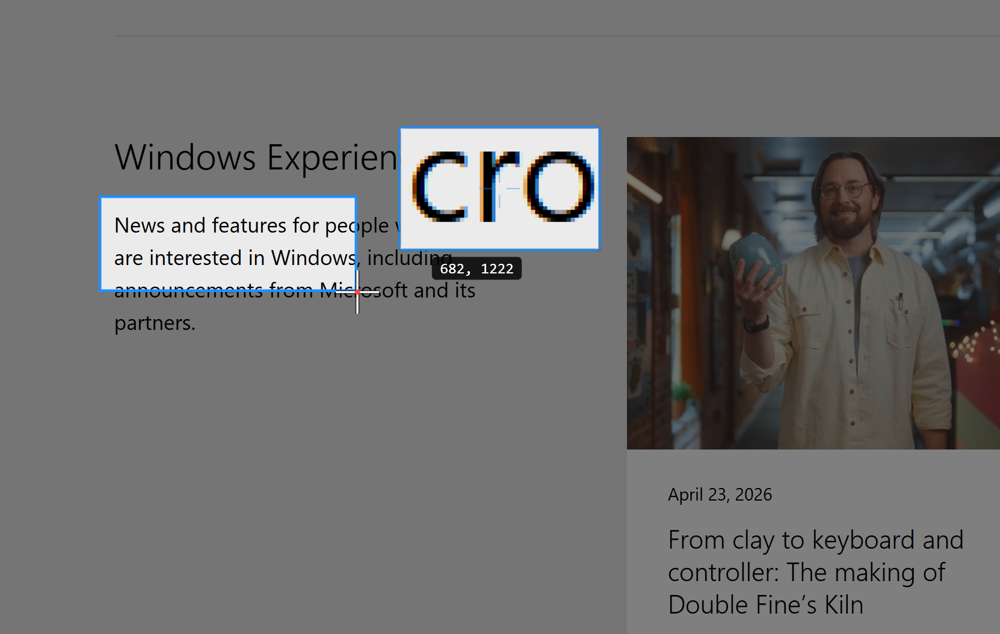
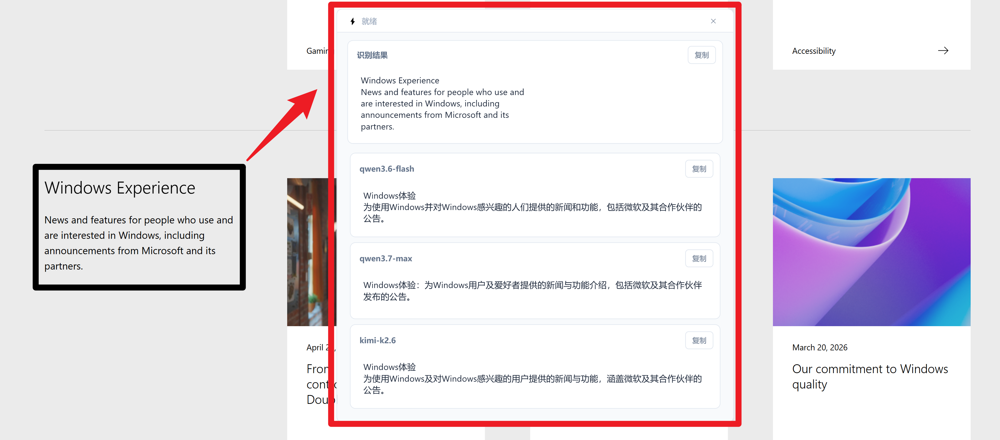
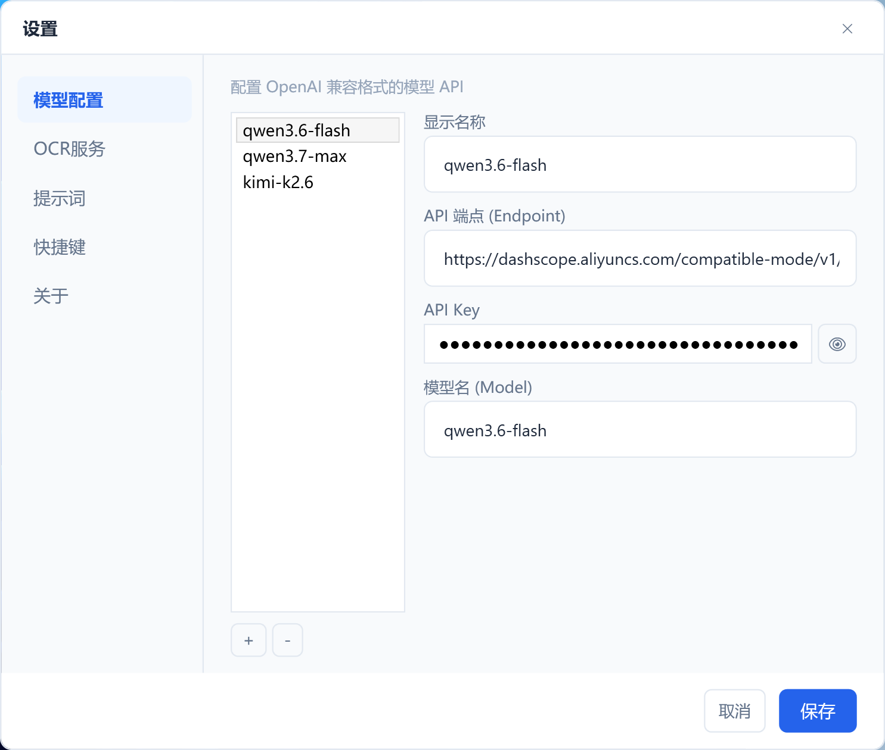
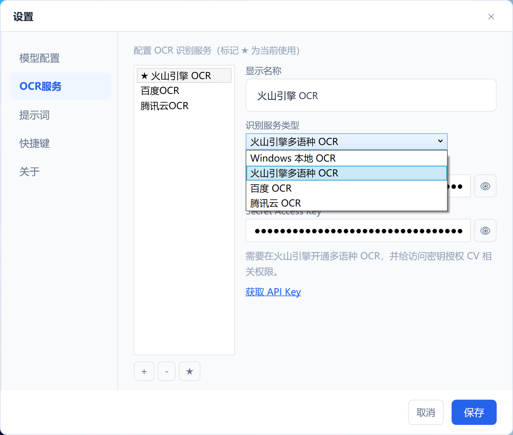

# SnapLingo

截图 → OCR 文字识别 → 多模型并发翻译的 Windows 桌面工具。

## 功能特点

- **全局快捷键截图** — 默认 `Ctrl+Shift+A`，可自定义
- **多种 OCR 引擎** — Windows 本地 OCR、火山引擎、百度 OCR、腾讯云 OCR
- **多模型并发翻译** — 支持任意 OpenAI 兼容 API，同时对比多个模型结果
- **自定义翻译提示词** — 灵活配置翻译策略
- **截图放大镜** — 精确选取截图边缘
- **开机自启动** — 可选，默认关闭
- **系统托盘常驻** — 不占用任务栏空间

## 功能展示

### 截图选区

使用全局快捷键触发截图，带放大镜辅助精确选取文字区域：



### 翻译结果

OCR 识别完成后，多模型并发翻译，对比不同结果：



### 设置 - 模型配置

支持添加多个 OpenAI 兼容 API 模型：



### 设置 - OCR 服务

支持多种 OCR 引擎，可添加多个服务并切换：



### 设置 - 快捷键与启动

自定义截图快捷键，可选开机自启动：


### 关于


## 安装

下载 [最新 Release](https://github.com/zouchanglin/SnapLingo/releases) 中的 `SnapLingo-vX.X.X-win-x64.zip`，解压后运行 `SnapLingo.exe` 即可。

## 使用说明

1. 首次运行后，右键系统托盘图标进入"设置"
2. 在"模型配置"中添加 OpenAI 兼容 API（如通义千问、DeepSeek、OpenAI 等）
3. 在"OCR"中配置 OCR 服务（Windows 本地 OCR 开箱即用，无需配置）
4. 按下快捷键（默认 `Ctrl+Shift+A`）开始截图翻译

## 系统要求

- Windows 10 1903+ / Windows 11
- [.NET 8 Desktop 运行时](https://dotnet.microsoft.com/download/dotnet/8.0)

## 构建

```bash
dotnet publish -c Release -r win-x64 --no-self-contained
```

## 开源协议

[MIT License](LICENSE)
